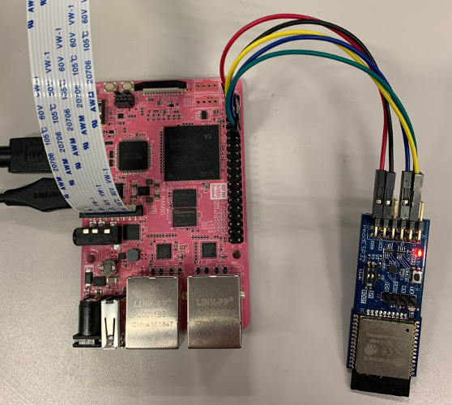
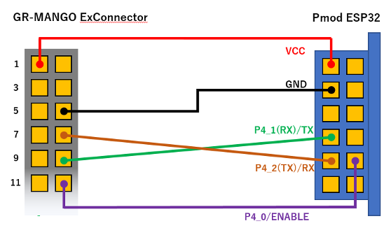
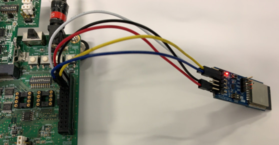
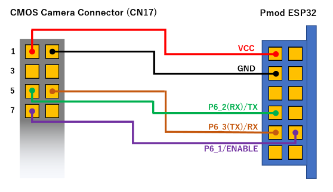

# RZ_A2M_BLE_sample
This is a sample program that works on RZ/A2M boards and RZ/A1 boards.  
- [RZ/A2M](https://www.renesas.com/us/en/products/microcontrollers-microprocessors/rz/rza/rza2m.html)
- [RZ/A1H](https://www.renesas.com/us/en/products/microcontrollers-microprocessors/rz/rza/rza1h.html)
- [RZ/A1LU](https://www.renesas.com/us/en/products/microcontrollers-microprocessors/rz/rza/rza1lu.html)

## Overview
It is equivalent to the following sample. Please refer to the following description.  
[BLE_LED](https://github.com/ARMmbed/mbed-os-example-ble/blob/master/BLE_LED)

The following samples that operate in the peripheral role also work. Replace the source folder and build.  
- [BLE_Button](https://github.com/ARMmbed/mbed-os-example-ble/blob/master/BLE_Button)  
- [BLE_BatteryLevel](https://github.com/ARMmbed/mbed-os-example-ble/blob/master/BLE_BatteryLevel)  
- [BLE_HeartRate](https://github.com/ARMmbed/mbed-os-example-ble/blob/master/BLE_HeartRate)  
- [BLE_Thermometer](https://github.com/ARMmbed/mbed-os-example-ble/blob/master/BLE_Thermometer)  

## Requirements
The following targets have been tested and work with these examples:

- GR-MANGO beta version
  - [Pmod ESP32](https://store.digilentinc.com/pmod-esp32-wireless-communication-module/)  
      
      

- [RZ/A2M Evaluation Board Kit](https://www.renesas.com/jp/en/products/software-tools/boards-and-kits/eval-kits/rz-a2m-evaluation-board-kit.html) (RZ/A2M)  
  - [Pmod ESP32](https://store.digilentinc.com/pmod-esp32-wireless-communication-module/)  
    Please update ESP32 FW ``AT version:1.1.3.0`` or later.  
      
      

- [SBEV-RZ/A2M](http://www.shimafuji.co.jp/products/1486) (RZ/A2M)  
  - IoT-Engine WIFI ESP32 (SEMB1401-1)  

- [SEMB1402](http://www.shimafuji.co.jp/products/1505) (RZ/A2M)  
  - IoT-Engine WIFI ESP32 (SEMB1401-1)  

- [GR-LYCHEE](https://os.mbed.com/platforms/Renesas-GR-LYCHEE/) (RZ/A1LU)  
  - It is equipped with ESP32.  
    Please update ESP32 FW ``AT version:1.1.3.0`` or later.  

- [GR-PEACH](https://os.mbed.com/platforms/Renesas-GR-PEACH/)  (RZ/A1H)
  - [GR-PEACH Wireless CAMERA Shield](https://www.core.co.jp/product/m2m/gr-peach/audio-camera.html)  
    Please update ESP32 FW ``AT version:1.1.3.0`` or later.  

The sample application can be seen on any BLE scanner on a smartphone. If you don't have a scanner on your phone, please install:

- [nRF Master Control Panel](https://play.google.com/store/apps/details?id=no.nordicsemi.android.mcp) for Android.

- [LightBlue](https://itunes.apple.com/gb/app/lightblue-bluetooth-low-energy/id557428110?mt=8) for iPhone.

## About custom boot loaders
This sample uses ``custom bootloader`` ``revision 5``, and you can drag & drop the "xxxx_application.bin" file to write the program. Please see [here](https://github.com/d-kato/bootloader_d_n_d) for the detail.  
### How to write program
#### For GR-MANGO
When using ``DAPLink``, please use ``xxxx.bin`` as following.  
1. Connect the ``micro USB type B terminal`` to the PC using a USB cable.
2. You can find the ``MBED`` directory.
3. Drag & drop ``xxxx.bin`` to the ``MBED`` directory.  
4. When writing is completed, press the reset button.  

When using ``custom bootloader``, please use ``xxxx_application.bin`` as following.  
1. Connect the ``USB type C terminal`` to the PC using a USB cable.  
2. Hold down ``USB0`` and press the reset button.  
3. You can find the ``GR-MANG`` directory.  
4. Drag & drop ``xxxx_application.bin`` to the ``GR-MANGO`` directory.  
5. When writing is completed, press the reset button.  

**Attention!**  
For the first time only, you need to write a ``custom bootloader`` using ``DAPLink``.  

#### For other boards
1. Connect the USB cable to the PC.  
2. Hold down ``SW3 (USB0)`` and press the reset button. (Or turn on the power.)  
3. You can find the ``MBED`` directory.  
4. Drag & drop ``xxxx_application.bin`` to the ``MBED`` directory.  
5. When writing is completed, press the reset button.  

**Attention!**  
For the first time only, you need to write a ``custom bootloader`` as following.  
[How to write a custom boot loader](https://github.com/d-kato/bootloader_d_n_d)  

## Development environment
Please refer to the following.  
https://github.com/d-kato/RZ_A2M_Mbed_samples

## How to update ESP32 firmware to "AT version:1.1.3.0"
Please refer to the following.  
https://github.com/d-kato/esp32-at-ble-stack

## Known issues
It works properly only in the peripheral role. The center role does not work properly with the ESP32 FW problem.  
