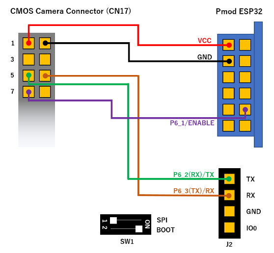
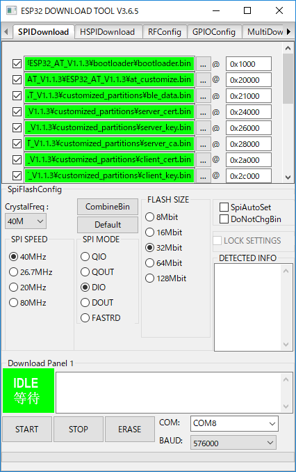

# RZ_A2M_BLE_sample
This is a sample program that works on RZ/A2M board.  

## Overview
It is equivalent to the following sample. Please refer to the following description.  
[BLE_LED](https://github.com/ARMmbed/mbed-os-example-ble/blob/master/BLE_LED)

The following samples that operate in the peripheral role also work. Replace the source folder and build.  
- [BLE_Button](https://github.com/ARMmbed/mbed-os-example-ble/blob/master/BLE_Button)  
- [BLE_BatteryLevel](https://github.com/ARMmbed/mbed-os-example-ble/blob/master/BLE_BatteryLevel)  
- [BLE_HeartRate](https://github.com/ARMmbed/mbed-os-example-ble/blob/master/BLE_HeartRate)  
- [BLE_Thermometer](https://github.com/ARMmbed/mbed-os-example-ble/blob/master/BLE_Thermometer)  

## Requirements
The following targets have been tested and work with these examples:

- [RZ/A2M Evaluation Board Kit](https://www.renesas.com/jp/en/products/software-tools/boards-and-kits/eval-kits/rz-a2m-evaluation-board-kit.html)
  - [Pmod ESP32](https://store.digilentinc.com/pmod-esp32-wireless-communication-module/)  
    Please update ESP32 FW ``AT version:1.1.3.0`` or later.  
      
      

- [SBEV-RZ/A2M](http://www.shimafuji.co.jp/products/1486) or [SEMB1402](http://www.shimafuji.co.jp/products/1505)
  - IoT-Engine WIFI ESP32 (SEMB1401-1)  

The sample application can be seen on any BLE scanner on a smartphone. If you don't have a scanner on your phone, please install:

- [nRF Master Control Panel](https://play.google.com/store/apps/details?id=no.nordicsemi.android.mcp) for Android.

- [LightBlue](https://itunes.apple.com/gb/app/lightblue-bluetooth-low-energy/id557428110?mt=8) for iPhone.

## About custom boot loaders
This sample uses a custom boot loader, and you can drag & drop the "xxxx_application.bin" file to write the program.  

1. Hold down ``SW3`` and press the reset button. (Or turn on the power.)  
2. Connect the USB cable to the PC, you can find the ``MBED`` directory.  
3. Drag & drop ``xxxx_application.bin`` to the ``MBED`` directory.  
4. When writing is completed, press the reset button.  

**Attention!**  
For the first time only, you need to write a custom bootloader as following.  
[How to write a custom boot loader](https://github.com/d-kato/bootloader_d_n_d)  

## Development environment
Please refer to the following.  
https://github.com/d-kato/RZ_A2M_Mbed_samples

## How to update the firmware of Pmod ESP32 to "AT version:1.1.3.0"

Write the following firmware to your board using custom boot loader:  
``RZ_A2M_BLE_sample/docs/serial_bridge/RZ_A2M_EVB_EPS32_Serial_Bridge_application.bin``  

Connection:  
  
Turn on SW1-2 of Pmod ESP32.  

Download the ESP32 firmware:  
https://www.espressif.com/en/support/download/at

Espressif’s official Flash Download Tools:  
http://espressif.com/en/support/download/other-tools?keys=&field_type_tid%5B%5D=13

  

  

The firmware settings are described in ``ESP32_AT_V1.1.3/download.config``.  
In the case of ESP32_AT_V1.1.3, the settings are as follows.  
* SPI SPEED : ``40MHz``
* SPI MODE : ``DIO``
* FLASH SIZE : ``32Mbit``
* COM : Set your board COM.
* BAUD : ``576000`` (If a write error occurs, try again with the smaller value.)  

|Path                                   |offset  |
|:--------------------------------------|:-------|
|bootloader/bootloader.bin              |0x1000  |
|at_customize.bin                       |0x20000 |
|customized_partitions/ble_data.bin     |0x21000 |
|customized_partitions/server_cert.bin  |0x24000 |
|customized_partitions/server_key.bin   |0x26000 |
|customized_partitions/server_ca.bin    |0x28000 |
|customized_partitions/client_cert.bin  |0x2a000 |
|customized_partitions/client_key.bin   |0x2c000 |
|customized_partitions/client_ca.bin    |0x2e000 |
|customized_partitions/factory_param.bin|0x30000 |
|phy_init_data.bin                      |0xf000  |
|esp-at.bin                             |0x100000|
|partitions_at.bin                      |0x8000  |

Procedure:  
1. Connect the ``USB-F`` connector to your PC using a USB cable.  
   **Attention!** It is not a ``UART`` connector used for printf output. It is a connector used by custom boot loader.  
2. Press ``BTN1`` on Pmod ESP32.  
3. Press the ``Erase`` button on the tool to erase the unwanted data on the flash. The green area labeled ``IDLE`` in the tool changes to ``FINISH`` when finished.  
4. Press ``BTN1`` on Pmod ESP32.  
5. Press the ``START`` button on the tool to start writing. The green area labeled ``IDLE`` in the tool changes to ``FINISH`` when finished.  

## Known issues
It works properly only in the peripheral role. The center role does not work properly with the ESP32 FW problem.  
